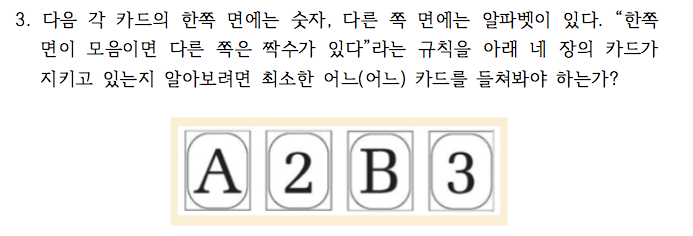

```{r setup, include=FALSE}
knitr::opts_chunk$set(echo = TRUE)
library(xlsx)
library(knitr)
options(width = 180)
```

```{r, data, echo = FALSE, results = 'hide'}
simbius <- read.xlsx(file = "../data/simbius_0809.xlsx", 
                     sheetIndex = 1, 
                     startRow = 2, 
                     endRow = 22, 
                     colIndex = 1:12, 
                     colClasses = c(rep("character", 12)), 
                     encoding = "UTF-8", stringsAsFactors = FALSE)
str(simbius)
```

```{r, data wrangling, echo = FALSE, results = 'hide'}
simbius$Group <- factor(simbius$Group, 
                        levels = c("Red", "Black"))
simbius$Monty <- factor(simbius$Monty, 
                        levels = c("가", "나"), 
                        labels = c("바꾼다", "고수한다"))
simbius$World <- factor(simbius$World, 
                        levels = c("가", "나"), 
                        labels = c("내가 남보다", "남이 나보다"))
simbius$Wason_1 <- ifelse(simbius$Wason_1 == "A,3", 
                          "Right", 
                          "Wrong")
simbius$Wason_2 <- ifelse(simbius$Wason_2 == "Beer,17", 
                          "Right", 
                          "Wrong")
simbius$Prospect <- factor(simbius$Prospect, 
                           levels = c("가", "나"), 
                           labels = c("100%", "90%"))
simbius$Framing <- factor(simbius$Framing, 
                          levels = c("가", "나"), 
                          labels = c("확정", "확률"))
simbius$Default <- ifelse(is.na(simbius$Default), 
                          "빈칸", 
                          simbius$Default)
simbius$Default.2 <- simbius$Default
Red <- simbius$Group == "Red"
Black <- simbius$Group == "Black"
simbius$Default.2[Red & simbius$Default.2 == "빈칸"] <- "있음"
simbius$Default.2[Red & simbius$Default.2 == "예"] <- "없음"
simbius$Default.2[Black & simbius$Default.2 == "빈칸"] <- "없음"
simbius$Default.2[Black & simbius$Default.2 == "예"] <- "있음"
simbius$Default.2[simbius$Default.2 == "NA"] <- NA
simbius$Default.2 <- factor(simbius$Default.2, 
                            level = c("있음", "없음"))
simbius$Default
str(simbius)
```

```{r, randomization, echo = FALSE, results = 'hide'}
kable(summary(simbius))
```

## 응답 비교

### Monty Hall 문제


```{r, Monty Hall, echo = FALSE}
kable(table(simbius$Group, simbius$Monty), caption = "몬티 홀 문제")
```

### Social Comparison (Which World?)


```{r, social comparison, echo = FALSE}
kable(table(simbius$Group, simbius$World), caption = "사회적 비교")
```

### Wason Selection 1



```{r, Wason 1, echo = FALSE}
kable(table(simbius$Group, simbius$Wason_1), caption = "Wason Selection 1")
```

### Wason Selection 2


```{r, Wason 2, echo = FALSE}
kable(table(simbius$Group, simbius$Wason_2), caption = "Wason Selection 2")
```

## Prospect Theory

### 이득과 손실

#### Red


#### Black


이득은 완전히 하고, 손실은 피하고자 하는 경향 확인. Red는 이득을 완전히 확보하려는 게임(가)에, Black은 손실을 확률적으로 피하려는 게임(나)을 많이 선택.

```{r, prospect theory, echo = FALSE}
tbl.P <- table(simbius$Group, simbius$Prospect)
rownames(tbl.P) <- c("Red(딴다)", "Black(잃는다)")
kable(tbl.P[1:2, ], caption = "손실회피심리")
```

## Framing Effect

### 삶과 죽음

#### Red


#### Black


600명 중 200명이 사는 거나 400명이 죽는 것, 모두 살리는 거나 모두 죽지 않는 것이나 같은 내용임에도 반응이 다르게 나타남에 유의. 손실회피 경향과 같은 현상을 관찰할 수 있음.

```{r, Framing Effect, echo = FALSE}
tbl.F <- table(simbius$Group, simbius$Framing)
rownames(tbl.F) <- c("Red(삶)", "Black(죽음)")
kable(tbl.F[1:2, ], caption = "Framing Effect")
```

## 디폴트 효과

### 표시하지 않으면 ... 으로 간주합니다의 효과

#### Red


#### Black


표시하지 않으면 장기 기증의사가 있는 것으로 간주하는 경우(Red)와 표시하면 장기 기증의사가 있는 것으로 간주하는 경우(Black), 표시하지 않으면 기증의사가 있다고 보는 질문지에 기증의사가 더 높게 나온다는 것에 유의. 어디다 디폴트를 두느냐에 따라 조사결과가 달라짐.

```{r, Default, echo = FALSE}
tbl.D <- table(simbius$Group, simbius$Default.2)
rownames(tbl.D) <- c("Red(없으면 표시)", "Black(있으면 표시)")
kable(tbl.D[1:2, ], caption = "장기기증의사")
```

```{r, save, echo = FALSE}
# save.image("../R/simbius.RData")
```